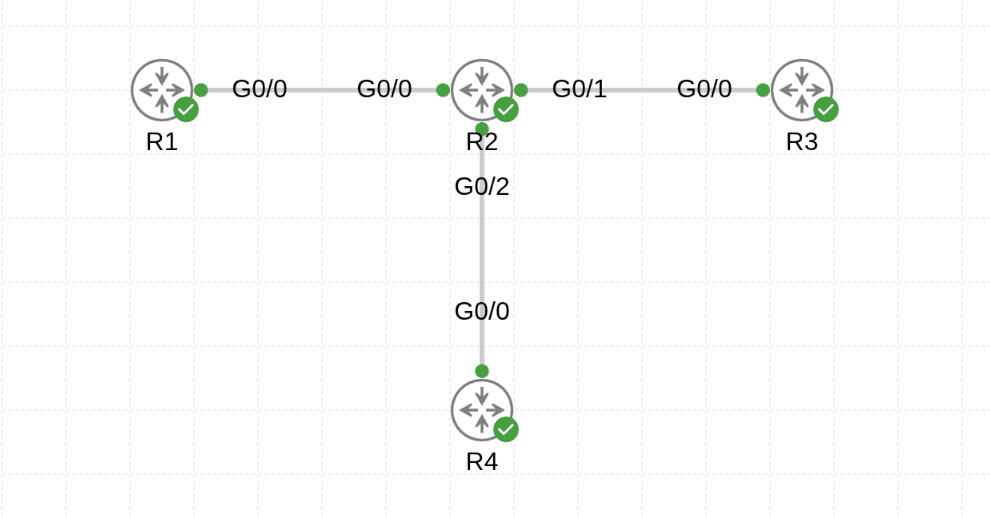
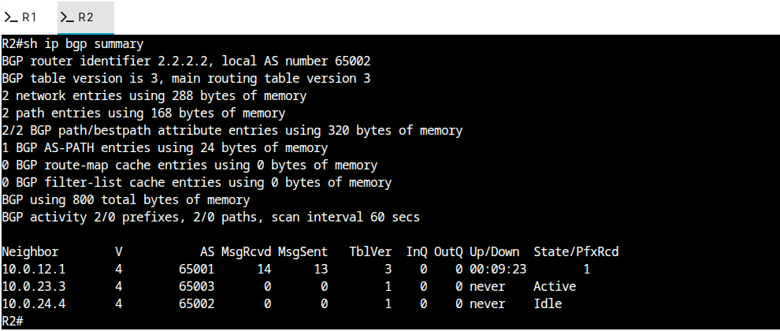

# CML + BGP Practice Lab

Python automation that builds a four-router BGP lab in Cisco Modeling Labs covering all the fundamentals: eBGP between three ASes, iBGP inside one of them, loopback advertisement, and `next-hop-self` on the iBGP pair. Good baseline for practicing route-maps, LOCAL_PREF, AS_PATH prepending, and path selection.

Script: [`bgp_lab_setup.py`](bgp_lab_setup.py)

## Topology

```
                       iBGP
        AS 65001         |          AS 65003
       ┌──────┐  eBGP  ┌─┴────┐  eBGP  ┌──────┐
       │  R1  │────────│  R2  │────────│  R3  │
       └──────┘        └───┬──┘        └──────┘
                           │
                       ┌───┴──┐
                       │  R4  │   (AS 65002, iBGP with R2)
                       └──────┘
```



### Addressing

| Router | AS | Loopback0 | Role |
|--------|----|-----------|------|
| R1 | 65001 | `1.1.1.1/32` | eBGP peer with R2 |
| R2 | 65002 | `2.2.2.2/32` | Transit: eBGP to R1 & R3, iBGP to R4 |
| R3 | 65003 | `3.3.3.3/32` | eBGP peer with R2 |
| R4 | 65002 | `4.4.4.4/32` | iBGP peer with R2 |

Point-to-point `/30`s:

| Link | Subnet | Addresses |
|------|--------|-----------|
| R1 ↔ R2 | `10.0.12.0/30` | R1=.1, R2=.2 |
| R2 ↔ R3 | `10.0.23.0/30` | R2=.2, R3=.3 |
| R2 ↔ R4 | `10.0.24.0/30` | R2=.2, R4=.4 |

Every router ships with `username cisco / password cisco` (enable: `cisco`) baked into its startup-config.

## Prerequisites

- CML 2.x controller with the `iosv` node definition installed
- Python 3.9+ and:

```bash
pip install virl2_client
```

## Run it

The script is interactive — it prompts for CML host, credentials, and lab name:

```bash
python bgp_lab_setup.py
```

Example session:

```
=======================================================
  CML BGP Practice Lab Builder
=======================================================
CML host or IP: cml.example.com
Username [admin]:
Password: ********
Lab name [BGP-Practice]:

[+] Connecting to https://cml.example.com ...
[+] Connected.
[+] Creating lab 'BGP-Practice' ...
[+] Creating routers ...
    + R1  AS65001  Lo0=1.1.1.1
    + R2  AS65002  Lo0=2.2.2.2
    + R3  AS65003  Lo0=3.3.3.3
    + R4  AS65002  Lo0=4.4.4.4
[+] Wiring links ...
    R1(GigabitEthernet0/1, 10.0.12.1) <-> R2(GigabitEthernet0/1, 10.0.12.2)
    R2(GigabitEthernet0/2, 10.0.23.2) <-> R3(GigabitEthernet0/1, 10.0.23.3)
    R2(GigabitEthernet0/3, 10.0.24.2) <-> R4(GigabitEthernet0/1, 10.0.24.4)
[+] Generating and pushing configs ...
    + config applied to R1
    + config applied to R2
    + config applied to R3
    + config applied to R4

[+] Starting lab (IOSv first boot takes a few minutes) ...
```

## Verify BGP convergence

Wait ~60–90 seconds after the lab reports running, then check the control plane. R2 is the most interesting node since it peers with everyone:

```text
R2# show ip bgp summary
Neighbor        V    AS  MsgRcvd  MsgSent   TblVer  InQ OutQ Up/Down  State/PfxRcd
10.0.12.1       4 65001       11       13        6    0    0 00:08:22        1
10.0.23.3       4 65003       10       12        6    0    0 00:08:15        1
10.0.24.4       4 65002        9       11        6    0    0 00:08:06        1
```



End-to-end checks from edge routers:

```text
R1# show ip route bgp         (expect 2/3/4.*.*.* via R2)
R3# show ip bgp               (expect 1.1.1.1 and 4.4.4.4 via R2)
R4# show ip bgp               (learns 1.1.1.1/3.3.3.3 from R2 via iBGP)
```

If R4 is seeing the prefixes from R1 and R3 but can't reach them, remember: R2 announces them with itself as next hop only because of `neighbor 10.0.24.4 next-hop-self` on the iBGP session. Without that, R4 would resolve the next-hop to the eBGP peer's IP, which isn't in its IGP.

## What the script actually does

1. **Prompts** for controller URL, credentials, and lab name (no hardcoded secrets).
2. **Connects** via `virl2_client.ClientLibrary` with `ssl_verify=False` (flip to `True` and trust the CA for real deployments).
3. **Creates the lab** and places four IOSv nodes at fixed coordinates so the layout is consistent between runs.
4. **Wires three `/30` links** using `next_available_interface()` — the script records the interface label and /30 address for both ends of every link.
5. **Generates each router's startup-config** from a template: service timestamps, hostname, `no ip domain lookup`, `ip cef`, a `username` / `enable secret`, `Loopback0`, a stanza per physical interface, and a `router bgp <asn>` block that advertises the loopback and peers with every directly-connected neighbor.
6. **Adds `next-hop-self`** automatically whenever the peer ASN matches the local ASN (i.e. iBGP).
7. **Boots the lab** with `lab.start(wait=True)` and prints the first handful of verification commands.

## Experiments to run next

The lab is designed so you can keep extending it without rebuilding:

- **Filter 4.4.4.4/32 from being advertised out of AS 65002** — prefix-list + route-map on R2's eBGP sessions. Watch R1 and R3 stop hearing about it.
- **LOCAL_PREF** — set LOCAL_PREF on R2 for prefixes learned from R1 vs R3 and observe the change in R2's path selection.
- **AS_PATH prepending** — prepend on R3's outbound updates and watch R1 prefer the AS 65001 → AS 65002 → AS 65003 path over any alternative you introduce.
- **Second eBGP link** — add an R1 ↔ R3 `/30` and see how path selection breaks the tie (router-id / neighbor address).
- **Route reflection** — scale AS 65002 up: add R5 in AS 65002 and make R2 a route-reflector for R4 and R5 instead of full-mesh iBGP.
- **Telemetry** — wire each router into the [observability stack](../../observability/README.md) (SNMP for IOSv) and watch BGP neighbor state flap in Grafana as you tear links down.

## Troubleshooting

- **`Node definition 'iosv' not found`** — install the IOSv image on the CML controller. `iosvl2` won't work (it's layer-2 only).
- **Neighbors stuck in `Idle` or `Active`** — verify L3 reachability first: `ping 10.0.12.2 source 10.0.12.1`. BGP can't peer if the transport can't.
- **iBGP session up but no prefixes in R4's table** — check `neighbor 10.0.24.4 next-hop-self` is configured on R2. Without it R4 will receive prefixes but with an unreachable next-hop and silently discard them.
- **Path selection seems wrong** — remember the order: WEIGHT → LOCAL_PREF → locally originated → shortest AS_PATH → origin → MED → eBGP over iBGP → closest next-hop → router-id tiebreaker. `show ip bgp <prefix>` shows the attributes used.
