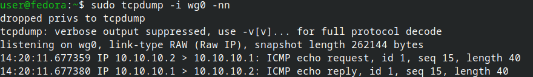
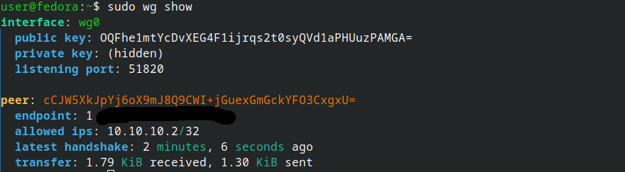
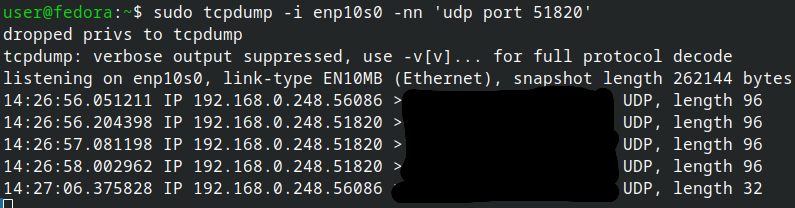

# WireGuard Remote Access: Fedora ↔ Windows

A concise guide for setting up WireGuard VPN to remotely access a Fedora machine from Windows, with SSH locked to the tunnel for security.

## Overview

- **Fedora**: WireGuard server, listens on UDP 51820
- **Windows**: WireGuard client, connects from anywhere with internet
- **Tunnel subnet**: `10.10.10.0/24` (server = `.1`, client = `.2`)
- **Security posture**: SSH only reachable via tunnel, not LAN or internet

---

## Part 1: Fedora Server Setup

### 1.1 Install WireGuard

```bash
sudo dnf install wireguard-tools -y
```

The kernel module is built into modern Fedora — no extra packages needed.

### 1.2 Generate server keys

```bash
cd /etc/wireguard
sudo sh -c 'umask 077; wg genkey | tee server_private.key | wg pubkey > server_public.key'
```

View them:

```bash
sudo cat /etc/wireguard/server_private.key
sudo cat /etc/wireguard/server_public.key
```

### 1.3 Create server config

Create `/etc/wireguard/wg0.conf`:

```ini
[Interface]
Address = 10.10.10.1/24
ListenPort = 51820
PrivateKey = <paste server_private.key contents>

[Peer]
PublicKey = <Windows client public key — fill in after Part 2>
AllowedIPs = 10.10.10.2/32
```

Set permissions:

```bash
sudo chmod 600 /etc/wireguard/wg0.conf
```

### 1.4 Configure firewall

Find your active zone first:

```bash
sudo firewall-cmd --get-active-zones
```

Typical active zone is `FedoraWorkstation` (desktop) or `FedoraServer`. Add WireGuard port to that zone and bind `wg0` to the trusted zone:

```bash
# Replace <active-zone> with whatever --get-active-zones returns
sudo firewall-cmd --permanent --zone=<active-zone> --add-port=51820/udp
sudo firewall-cmd --permanent --zone=trusted --add-interface=wg0
sudo firewall-cmd --reload
```

### 1.5 Start and enable the tunnel

```bash
sudo systemctl enable --now wg-quick@wg0
```

### 1.6 Router port forward

On your home router, forward **UDP 51820** to the Fedora box's LAN IP.

Find the Fedora LAN IP:

```bash
ip -4 addr show | grep inet
```

Find your public IP (what to put in Windows `Endpoint`):

```bash
curl -4 ifconfig.me
```

⚠️ **CGNAT check**: if `curl -4 ifconfig.me` doesn't match your router's WAN IP, you're behind CGNAT and port forwarding won't work. Use Tailscale instead.

---

## Part 2: Windows Client Setup

### 2.1 Install WireGuard

Download from [wireguard.com/install](https://www.wireguard.com/install/) and install.

### 2.2 Create empty tunnel

Open WireGuard → **Add Tunnel → Add empty tunnel...**

A keypair is auto-generated. **Copy the public key shown at the top** — you'll paste it into the Fedora config.

### 2.3 Fill in the config

Replace the dialog contents with:

```ini
[Interface]
PrivateKey = <leave the auto-generated one>
Address = 10.10.10.2/32
DNS = 1.1.1.1

[Peer]
PublicKey = <Fedora server's public key>
Endpoint = <your-public-ip-or-ddns>:51820
AllowedIPs = 10.10.10.0/24
PersistentKeepalive = 25
```

Name the tunnel (e.g. `fedora-home`) and save.

### 2.4 Paste Windows public key into Fedora config

Back on Fedora:

```bash
sudo nano /etc/wireguard/wg0.conf
```

Replace the `<Windows client public key>` placeholder with the actual key from Windows, then restart:

```bash
sudo systemctl restart wg-quick@wg0
```

### 2.5 Activate on Windows

In the WireGuard GUI, click **Activate**. Status should flip to "Active" within seconds.

---

## Part 3: Verification & Sanity Checks

### 3.1 Check WireGuard is running (Fedora)

```bash
sudo systemctl status wg-quick@wg0
sudo wg show
ip -brief addr | grep wg0
```

Expected: service active, `wg0` interface with `10.10.10.1/24`, listening port 51820.

### 3.2 Verify keys match on both sides

**Server public key (Fedora):**

```bash
sudo wg show wg0 public-key
```

This must equal the `[Peer] PublicKey` in your Windows config.

**Check peer public key Fedora expects:**

```bash
sudo wg show wg0 | grep peer
```

This must equal the **Public key** shown in the Windows WireGuard GUI.

**Validate key lengths (should all be 44 chars ending in `=`):**

```bash
sudo grep -E "PrivateKey|PublicKey" /etc/wireguard/wg0.conf | awk '{print $3, "length:", length($3)}'
```

### 3.3 Sanity-check config file

```bash
sudo cat /etc/wireguard/wg0.conf
sudo ls -la /etc/wireguard/
```

Config should have both `[Interface]` and `[Peer]` blocks with no placeholder text. Permissions should be `-rw-------` (600), owned by root.

**Validate config parses correctly:**

```bash
sudo wg-quick strip wg0
```

Prints clean config if valid, errors if not.

### 3.4 Verify firewall state

```bash
sudo firewall-cmd --get-active-zones
sudo firewall-cmd --zone=<active-zone> --list-all
sudo firewall-cmd --zone=trusted --list-all
```

Active zone should have `51820/udp` in ports. Trusted zone should have `wg0` in interfaces with `target: ACCEPT`.

### 3.5 Confirm port is listening

```bash
sudo ss -ulnp | grep 51820
```

Should show something bound to `*:51820`.

### 3.6 Test handshake live

On Fedora, run tcpdump to watch packets. First identify your WAN-facing interface:

```bash
ip route | grep default
```

Note the `dev <name>` — that's your WAN interface. Then:

```bash
sudo tcpdump -i any -n udp port 51820
```

(`-i any` captures on all interfaces, easiest for troubleshooting.)

Then click Activate on Windows (from outside your LAN — use phone hotspot). You should see both incoming and outgoing packets within a second.

**Interpreting tcpdump output:**

- **In + Out packets** → handshake working
- **Only In, no Out** → Fedora receives but doesn't respond (firewall or config issue)
- **No packets** → traffic not reaching Fedora (router forward or CGNAT)

### 3.7 Confirm handshake completed

After activating Windows tunnel:

```bash
sudo wg show
```

Look for:
- `latest handshake: X seconds ago`
- `transfer: X received, Y sent` with non-zero values

### 3.8 Test connectivity

From Windows PowerShell with tunnel active:

```powershell
ping 10.10.10.1
ssh <user>@10.10.10.1
```

---

## Part 4: Lock SSH to the Tunnel (Recommended)

Once SSH works through the tunnel, remove it from public exposure.

### 4.1 Remove SSH from active zone

```bash
sudo firewall-cmd --permanent --zone=<active-zone> --remove-service=ssh
sudo firewall-cmd --reload
```

### 4.2 Verify SSH still works via tunnel

From Windows (tunnel active):

```powershell
ssh <user>@10.10.10.1
```

Should still work — `wg0` is in the trusted zone which allows all traffic.

### 4.3 Verify SSH blocked from LAN

From any other LAN device:

```
ssh <user>@<fedora-lan-ip>
```

Should time out or be refused.

### 4.4 Optional: Key-only SSH auth

Generate an Ed25519 key on Windows:

```powershell
ssh-keygen -t ed25519
ssh-copy-id <user>@10.10.10.1
```

Then disable password auth on Fedora — edit `/etc/ssh/sshd_config`:

```
PasswordAuthentication no
PermitRootLogin no
```

Reload:

```bash
sudo systemctl reload sshd
```

---

## Part 5: Troubleshooting Quick Reference

### No handshake (bytes sent but not received)

1. Check tcpdump on Fedora — are packets arriving?
2. If **no**: router port forward, stale endpoint IP, or CGNAT
3. If **yes** but no response: firewall or key mismatch

### Endpoint IP changed (dynamic home IP)

```bash
curl -4 ifconfig.me
```

Update the Windows config's `Endpoint =` line with the new value.

### Tunnel shows active but ping fails

Check `wg0` is in trusted zone:

```bash
sudo firewall-cmd --zone=trusted --list-interfaces
```

If missing:

```bash
sudo firewall-cmd --permanent --zone=trusted --add-interface=wg0
sudo firewall-cmd --reload
```

### Service fails to start

```bash
sudo journalctl -u wg-quick@wg0 -n 50 --no-pager
```

Common causes:
- Key length not 44 chars → regenerate or re-paste
- Port 51820 already in use → `sudo ss -ulnp | grep 51820`
- Placeholder text left in config → re-check `wg0.conf`

### Verify after reboot

```bash
sudo systemctl is-enabled wg-quick@wg0   # should say: enabled
sudo wg show
ip -brief addr | grep wg0
```

---

## Final Expected State

### Fedora firewall

```
<active-zone> (default, active)
  interfaces: <your-wan-interface>
  services: dhcpv6-client
  ports: 51820/udp
  masquerade: no

trusted (active)
  interfaces: wg0
  target: ACCEPT
```

### What you can do now

- Activate Windows WireGuard tunnel from any internet connection
- `ssh user@10.10.10.1` into Fedora
- SSH is invisible to the internet and LAN
- Port 51820/udp is the only thing exposed externally

---

## Data Usage Reference (over tunnel)

| Activity | Data/hour |
|---|---|
| SSH (terminal) | 1-10 MB |
| X11 forwarding (single GUI app) | 20-100 MB |
| RDP, tuned for low bandwidth | 100-200 MB |
| RDP, defaults | 200-500 MB |
| RDP with video | 1-5 GB (avoid) |

Use SSH for most things, RDP only when GUI is necessary.

---

## Verification

Three screenshots from a working lab tunnel, captured at the three layers worth checking after a bring-up:

### 1. Tunnel active on the Windows client



The Windows WireGuard UI after activating the tunnel. Look for a recent *Latest handshake* (within the last 2 minutes) and non-zero *Transfer* — that confirms the server responded and bidirectional traffic is flowing.

### 2. Interface state on the Fedora server



`ip addr show wg0` and `sudo wg` on the server side. `wg0` carries `10.10.10.1/24`, the peer's public key and endpoint (the client's public IP) are listed, and `latest handshake` matches what the client is reporting.

### 3. Encrypted traffic on the physical NIC



`sudo tcpdump -i <wan-iface> -n host <client-public-ip>` during an SSH session over the tunnel. All traffic is UDP/51820 — no TCP/22 packets visible on the physical interface. This is the proof that SSH is genuinely inside the tunnel rather than leaking onto the LAN.
