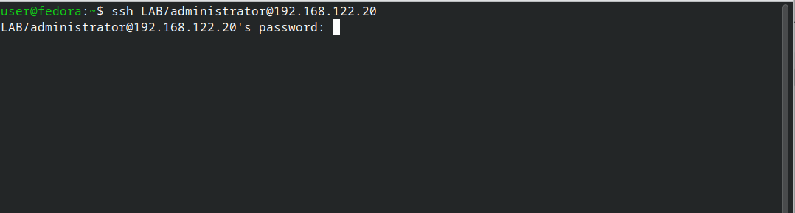
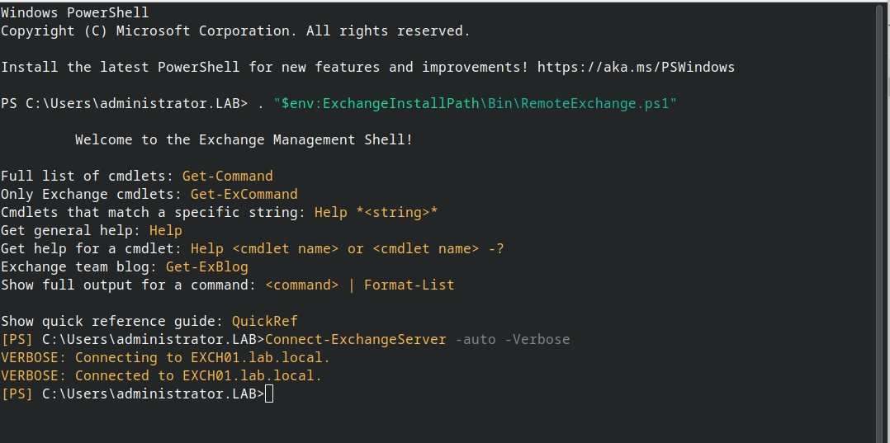
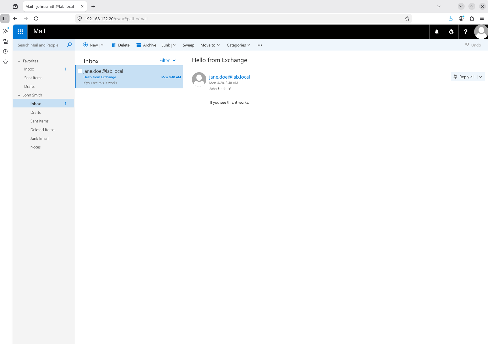

# KVM + Exchange

Exchange Server 2019 lab joined to the `lab.local` AD domain from the [KVM + Active Directory](kvm-active-directory.md) guide, with one mailbox database on a dedicated data disk and a couple of test mailboxes. Pure lab — not hardened, not supported sizing, but functional.

## Provision the VM

Two qcow2 disks: one for the OS, one for the mailbox database. Keeping data off the system drive matches the real-world guidance and makes snapshots more useful.

```bash
sudo qemu-img create -f qcow2 /var/lib/libvirt/images/exch01-os.qcow2 100G && sudo qemu-img create -f qcow2 /var/lib/libvirt/images/exch01-data.qcow2 100G && sudo chown root:qemu /var/lib/libvirt/images/exch01-*.qcow2 && sudo chmod 660 /var/lib/libvirt/images/exch01-*.qcow2
```

## Install Windows into Exchange disks (with ISO)

```bash
sudo virt-install --name exch01 --memory 16384 --vcpus 4 --cpu host-passthrough --disk path=/var/lib/libvirt/images/exch01-os.qcow2,format=qcow2,bus=sata,cache=none --disk path=/var/lib/libvirt/images/exch01-data.qcow2,format=qcow2,bus=sata,cache=none --cdrom /var/lib/libvirt/images/SERVER_EVAL_x64FRE_en-us.iso --network network=default,model=e1000e --os-variant win2k22 --graphics spice
```

## Prerequisites

Before starting, the AD VM (`DC01`, `192.168.122.10`) must be up and the forest `lab.local` created. In the Exchange VM:

- Static IP (say `192.168.122.20`)
- DNS pointed at `192.168.122.10` (the DC), **not 127.0.0.1**
- Joined to `lab.local`
- Logged in as `LAB\Administrator`
- Second disk (`E:`) online, initialized GPT, formatted NTFS

Quick baseline inside the Exchange VM (**PowerShell as Administrator**):

```powershell
# Static IP + DNS at DC
New-NetIPAddress -InterfaceAlias "Ethernet" `
  -IPAddress 192.168.122.20 -PrefixLength 24 -DefaultGateway 192.168.122.1
Set-DnsClientServerAddress -InterfaceAlias "Ethernet" -ServerAddresses 192.168.122.10

# Rename and join domain (reboots twice)
Rename-Computer -NewName "EXCH01" -Restart
# After reboot, log back in as local admin
Add-Computer -DomainName "lab.local" -Credential (Get-Credential) -Restart
# Enter LAB\Administrator + its password when prompted

# After second reboot, bring the data disk online and format E:
Get-Disk | Where-Object PartitionStyle -eq 'RAW' | `
  Initialize-Disk -PartitionStyle GPT -PassThru | `
  New-Partition -AssignDriveLetter -UseMaximumSize | `
  Format-Volume -FileSystem NTFS -NewFileSystemLabel "ExchangeData" -Confirm:$false
```

## Enable OpenSSH (optional)

Lets you paste PowerShell from the Fedora host without the SPICE console.

```powershell
# 1. Install the OpenSSH Server capability
Add-WindowsCapability -Online -Name OpenSSH.Server~~~~0.0.1.0

# 2. Start the service and set it to auto-start
Start-Service sshd
Set-Service -Name sshd -StartupType Automatic

# 3. Open the firewall (the installer usually creates this rule, but confirm)
if (-not (Get-NetFirewallRule -Name "OpenSSH-Server-In-TCP" -ErrorAction SilentlyContinue)) {
    New-NetFirewallRule -Name "OpenSSH-Server-In-TCP" -DisplayName "OpenSSH Server (sshd)" `
        -Enabled True -Direction Inbound -Protocol TCP -Action Allow -LocalPort 22
}

# 4. Make PowerShell the default shell (so `ssh user@host` drops you into pwsh, not cmd)
New-ItemProperty -Path "HKLM:\SOFTWARE\OpenSSH" -Name DefaultShell `
  -Value "C:\Windows\System32\WindowsPowerShell\v1.0\powershell.exe" -PropertyType String -Force
```

Same steps packaged as [`scripts/enable-ssh.ps1`](../scripts/enable-ssh.ps1).

## Step 1 — Install prerequisites

Exchange 2019 CU14+ on Server 2022 needs: .NET Framework 4.8 (built in), Visual C++ Redistributable 2013, UCMA 4.0, IIS URL Rewrite, and a pile of Windows features.

```powershell
# Windows features (reboots at the end)
Install-WindowsFeature Server-Media-Foundation, NET-Framework-45-Features, `
  RPC-over-HTTP-proxy, RSAT-Clustering, RSAT-Clustering-CmdInterface, `
  RSAT-Clustering-Mgmt, RSAT-Clustering-PowerShell, WAS-Process-Model, `
  Web-Asp-Net45, Web-Basic-Auth, Web-Client-Auth, Web-Digest-Auth, `
  Web-Dir-Browsing, Web-Dyn-Compression, Web-Http-Errors, Web-Http-Logging, `
  Web-Http-Redirect, Web-Http-Tracing, Web-ISAPI-Ext, Web-ISAPI-Filter, `
  Web-Lgcy-Mgmt-Console, Web-Metabase, Web-Mgmt-Console, Web-Mgmt-Service, `
  Web-Net-Ext45, Web-Request-Monitor, Web-Server, Web-Stat-Compression, `
  Web-Static-Content, Web-Windows-Auth, Web-WMI, Windows-Identity-Foundation, `
  RSAT-ADDS -Restart
```

After reboot, install the downloadable prereqs. Easiest path is to put them on your Samba share from the Fedora host and pull them across. Downloads (get these on Fedora first, drop in `~/vm-share`):

- **UCMA 4.0** — `UcmaRuntimeSetup.exe` from Microsoft Download Center
- **Visual C++ 2013 Redistributable x64** — `vcredist_x64.exe`
- **IIS URL Rewrite Module 2** — `rewrite_amd64_en-US.msi`

Then in the VM:

```powershell
# Assumes you mapped the Samba share to Z:
Start-Process -Wait Z:\UcmaRuntimeSetup.exe  -ArgumentList "/quiet /norestart"
Start-Process -Wait Z:\vcredist_x64.exe       -ArgumentList "/quiet /norestart"
Start-Process -Wait msiexec.exe -ArgumentList "/i Z:\rewrite_amd64_en-US.msi /quiet /norestart"
```

## Step 2 — Prepare Active Directory

Run from the Exchange VM. These modify the AD schema and create Exchange containers. Needs Schema Admins and Enterprise Admins membership — `LAB\Administrator` has both by default for the forest root.

```powershell
# From the Exchange installer ISO (downloaded separately from the Windows Server image) — mount it first, then cd to its drive
# Assuming the ISO is mounted as D:
D:
.\Setup.exe /IAcceptExchangeServerLicenseTerms_DiagnosticDataON /PrepareSchema
.\Setup.exe /IAcceptExchangeServerLicenseTerms_DiagnosticDataON /PrepareAD /OrganizationName:"LabOrg"
.\Setup.exe /IAcceptExchangeServerLicenseTerms_DiagnosticDataON /PrepareDomain
```

Each takes a few minutes. After `/PrepareAD`, wait for AD replication (in a single-DC lab, that's instant).

The flag name depends on your CU version:

- Pre-CU14: `/IAcceptExchangeServerLicenseTerms`
- CU14+: `/IAcceptExchangeServerLicenseTerms_DiagnosticDataON` (or `_OFF`)

The installer complains clearly if you pick the wrong one.

## Step 3 — Install Exchange

```powershell
D:
.\Setup.exe /IAcceptExchangeServerLicenseTerms_DiagnosticDataON `
  /Mode:Install `
  /Roles:Mailbox `
  /MdbName:"MBX01" `
  /DbFilePath:"E:\ExchangeDB\MBX01.edb" `
  /LogFolderPath:"E:\ExchangeLogs" `
  /TargetDir:"C:\Program Files\Microsoft\Exchange Server\V15"
```

This is the silent install. 60–90 minutes. Creates the mailbox database on `E:` from the start, so you don't have to move it afterwards. Reboots when done.

If you'd rather click through the GUI, just run `D:\Setup.exe` and pick Mailbox role — same result, more clicks.

## Step 4 — Verify it's alive

After the final reboot, log in as `LAB\Administrator` and open the **Exchange Management Shell** (shortcut on the Start menu):

```powershell
# Basic health
Get-ExchangeServer
Get-MailboxDatabase -Status | Format-List Name, Mounted, DatabaseSize

# All core services should be Running
Get-Service MSExchange* | Where-Object Status -ne 'Running'   # should return nothing
```

If `Get-MailboxDatabase` shows `Mounted : True`, the core install worked.

### Activating Exchange Management Shell inside SSH

The Start-menu EMS shortcut only exists on the console. Over SSH you get plain PowerShell — `Get-ExchangeServer` will error with "not recognized as a cmdlet" until the Exchange snap-in is loaded. Two commands do it:

```powershell
. "$env:ExchangeInstallPath\Bin\RemoteExchange.ps1"
Connect-ExchangeServer -auto -Verbose
```

The first dot-sources Exchange's bootstrap script (loads functions and aliases into the session); the second opens an implicit PowerShell remoting session to the local Exchange server, which is what actually exposes `Get-ExchangeServer`, `Get-Mailbox`, and the rest of the `*-Mailbox*` cmdlets.





Put both lines at the top of `$PROFILE` on the Exchange box and every SSH session drops straight into a working EMS.

## Step 5 — Create test mailboxes

```powershell
# Give the existing AD user a mailbox
Enable-Mailbox -Identity "jane.doe" -Database "MBX01"

# Create a brand-new user with a mailbox in one shot
New-Mailbox -Name "John Smith" -UserPrincipalName "john.smith@lab.local" `
  -Alias "john.smith" -OrganizationalUnit "lab.local/LabUsers" `
  -Database "MBX01" -FirstName "John" -LastName "Smith" `
  -Password (ConvertTo-SecureString "TempP@ss123!" -AsPlainText -Force) `
  -ResetPasswordOnNextLogon $true

# List all mailboxes
Get-Mailbox
```

## Step 6 — Set the external URLs (lab defaults)

Out of the box, internal URLs point at `EXCH01.lab.local` but external URLs are unset, which makes Outlook anywhere / OWA from off the server behave oddly. Set them to match the internal ones for a lab:

```powershell
$fqdn = "mail.lab.local"

# Add a DNS record so the name resolves: on DC01, run
#   Add-DnsServerResourceRecordA -ZoneName "lab.local" -Name "mail" `
#     -IPv4Address "192.168.122.20"

Get-OwaVirtualDirectory |
  Set-OwaVirtualDirectory -InternalUrl "https://$fqdn/owa" -ExternalUrl "https://$fqdn/owa"

Get-EcpVirtualDirectory |
  Set-EcpVirtualDirectory -InternalUrl "https://$fqdn/ecp" -ExternalUrl "https://$fqdn/ecp"

Get-WebServicesVirtualDirectory |
  Set-WebServicesVirtualDirectory -InternalUrl "https://$fqdn/EWS/Exchange.asmx" -ExternalUrl "https://$fqdn/EWS/Exchange.asmx"

Get-ActiveSyncVirtualDirectory |
  Set-ActiveSyncVirtualDirectory -InternalUrl "https://$fqdn/Microsoft-Server-ActiveSync" -ExternalUrl "https://$fqdn/Microsoft-Server-ActiveSync"

Get-OabVirtualDirectory |
  Set-OabVirtualDirectory -InternalUrl "https://$fqdn/OAB" -ExternalUrl "https://$fqdn/OAB"

Get-ClientAccessService EXCH01 |
  Set-ClientAccessService -AutoDiscoverServiceInternalUri "https://$fqdn/Autodiscover/Autodiscover.xml"

iisreset
```

## Step 7 — Log into OWA

From any machine that can resolve `mail.lab.local` (or just use the IP):

```
https://192.168.122.20/owa
```

Accept the certificate warning — Exchange generates a self-signed cert during install and it's not trusted by default. Log in as `lab\jane.doe` with the password you set in AD. You should land in Outlook Web Access.

If you set up the port-forwarding guide from earlier, forward 443 to `192.168.122.20:443` and you can reach OWA through WireGuard from anywhere.

## Send a test message

In OWA or from the Exchange Management Shell:

```powershell
# Send from one test mailbox to another (requires SMTP bindings, works by default for internal)
Send-MailMessage -From "jane.doe@lab.local" -To "john.smith@lab.local" `
  -Subject "Hello from Exchange" -Body "If you see this, it works." `
  -SmtpServer "EXCH01.lab.local"

# Check John's inbox
Get-MailboxFolderStatistics -Identity john.smith -FolderScope Inbox | `
  Select-Object Name, ItemsInFolder, FolderSize
```

## Clean shutdown

Exchange does not handle abrupt power-off well — in-flight transactions sit in transaction logs until next mount, and dirty databases can fail to remount without `eseutil` repair. Before shutting down the VM, dismount databases and stop services in dependency order.

```powershell
# 1. Dismount all mailbox databases (flushes logs to disk)
Get-MailboxDatabase -Server EXCH01 | Dismount-Database -Confirm:$false

# 2. Stop Exchange services in dependency order
$services = @(
    'MSExchangeTransport',
    'MSExchangeFrontEndTransport',
    'MSExchangeMailboxAssistants',
    'MSExchangeMailboxReplication',
    'MSExchangeRepl',
    'MSExchangeRPC',
    'MSExchangeIS',
    'MSExchangeServiceHost',
    'MSExchangeADTopology'
)
foreach ($s in $services) {
    Stop-Service -Name $s -Force -ErrorAction SilentlyContinue
}

# 3. Confirm everything's stopped
Get-Service MSExchange* | Where-Object Status -ne Stopped
# ^ should return nothing

# Get any others
Get-Service MSExchange* | Where-Object Status -ne 'Stopped' | Stop-Service -Force

# 4. Now you can shut down Windows
Stop-Computer -Force
```

A more thorough version with dependency verification is packaged as [`scripts/shutdown-exchange.ps1`](../scripts/shutdown-exchange.ps1) — it also stops IIS, covers every MSExchange* service, and bails out early if any database fails to dismount.

## Things you can lab next

Once the above works, good follow-ups that exercise real features:

- **Accepted domains and email address policies** — add `lab.local` as authoritative, then add `lab.example.com` as an additional accepted domain and route mail for it.
- **Send connectors** — configure outbound mail through a smart host or direct DNS.
- **DAG (Database Availability Group)** — requires a second Exchange server. Good for learning replication and failover.
- **Hybrid with Microsoft 365** — far more involved, needs real DNS and an Entra tenant, but the most realistic modern skill.
- **Transport rules** — lab-safe way to explore mail flow manipulation.
- **Backup and recovery** — take a snapshot, delete a mailbox, restore from the EDB.

## Things to know about lab Exchange

**RAM pressure.** With 16 GB, Exchange will feel slow. The store (`Microsoft.Exchange.Store.Worker`) will consume most of it. That's Exchange being Exchange, not a misconfiguration.

**Eval clock.** Exchange 2019 evaluation is 120 days from install. `slmgr` doesn't extend it; you'd need a key to convert. For lab work, 120 days is plenty — snapshot the VM once it's working and revert when you want a clean slate.

**Mail out to the internet.** Won't work without proper DNS, a public IP, or a relay. For lab testing, keep mail internal between mailboxes in your domain, or set up a send connector pointing at a fake SMTP sink like `smtp4dev` or `MailHog` running in another VM.

**CU updates.** Exchange is updated via Cumulative Updates, not Windows Update. Don't let Windows Update install random Exchange patches mid-lab; plan CU installs like you would in production.

## If the install fails partway through

Exchange's installer leaves detailed logs at `C:\ExchangeSetupLogs\`. The most useful one is `ExchangeSetup.log`. Grep for `[ERROR]`:

```powershell
Select-String -Path C:\ExchangeSetupLogs\ExchangeSetup.log -Pattern '\[ERROR\]' | `
  Select-Object -Last 20
```

Common causes: missing a prereq (UCMA, VC++ 2013), AD not fully replicated after `/PrepareAD`, or a prior failed install leaving orphan objects. Recovery mode (`/Mode:RecoverServer`) handles the last case; rerunning `/PrepareAD` and waiting 15 minutes handles the second.

## One-liner smoke test

Fastest way to prove the whole stack — AD, schema, store, and mailbox provisioning — is wired up end-to-end is to create a user-plus-mailbox in a single command from EMS. No OU touch-ups, no password reset flow, no `Enable-Mailbox` round-trip:

```powershell
New-Mailbox -Name "John Smith" -UserPrincipalName john.smith@lab.local -Alias john.smith -SamAccountName john.smith -FirstName John -LastName Smith -DisplayName "John Smith" -Password (ConvertTo-SecureString "P@ssw0rd123!" -AsPlainText -Force) -ResetPasswordOnNextLogon $true
```

If it returns a mailbox object with a populated `Database` and `ServerName`, Exchange is doing the work it's supposed to: creating the AD user, stamping the Exchange attributes, and provisioning the mailbox in the store.



Clean up with `Remove-Mailbox -Identity john.smith -Permanent $true -Confirm:$false` when you're done — `-Permanent` also deletes the backing AD user, so there's nothing to tidy up in ADUC afterwards.
